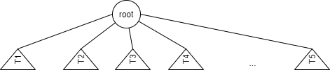
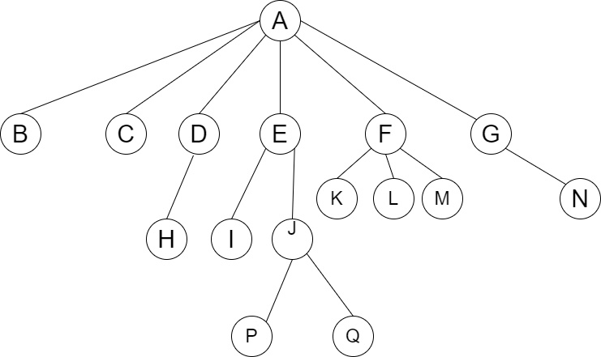
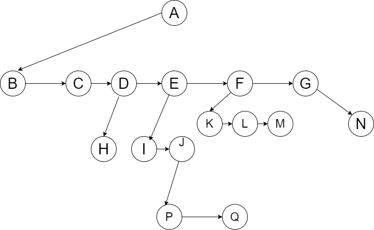
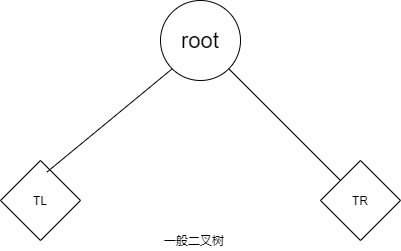
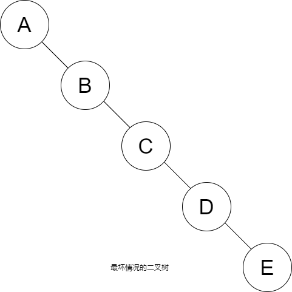
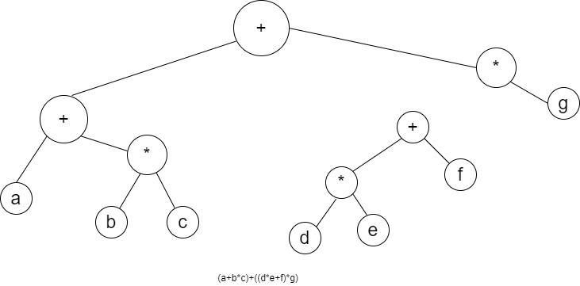

# 数据结构
## 术语
 - 抽象数据类型(Abstract Data Type,ADT) - 抽象数据类型是数学的抽象，例如表、集合、
图以及它们的操作，都可以看作抽象数据类型，就像证书、实数布尔量是数据类型一样。

## 表ADT
### 链表
> 为了避免插入和删除的线性开销，我们允许表可以不连续存储，否则表的部分或全部需要整体移动。
> 链表实现了这一想法。
```text
链表由一系列不必在内存中相连的结构组成。每一个结构体均含有表元素和指向包含该元素后继元的指针。
我们称之为Next指针。最后一个单元的Next指针指向NULL;

需要注意的是，必须指明链表中第一个元素的位置。一旦知道第一个元素的位置，就能根据其中的链接信息
访问第二个元素，接着访问第三个元素，以此类推。指向链表第一个元素的引用被称作头。最后一个元素
需要知道自己没有下一个元素。
```

### 双链表
```text
有时候以倒序扫描链表很方便。方法是在数据结构上附加一个域，使它包含指向前一个单元的指针即可。
其开销是一个附加的链，它增加了空间的需求，同时也使得插入和删除的开销增加一倍，因为有更多的
指针需要定位。另外，它简化了删除操作，因为你不再被迫使用一个指向向前驱元的指针来访问一个关键字，
这个信息是现成的。
```

### 循环链表
```text
让最后的单元反过来直指第一个单元是一种流行的做法。它可以由表头，也可以没有表头，并且还可以是双向
链表(第一个单元的前驱元指向最后的单元)。
```

## 栈ADT
### 栈模型
> 栈是限制插入和删除只能在一个位置上进行的表，该位置是表的末端，叫做栈的顶(top)。

> 对栈的基本操作有Push进栈和Pop出栈

> 栈有时又叫做LIFO(后进先出)表。

> 一般的模型是，存在某个元素位于栈顶，而该元素是唯一的可见元素。

它支持以下动作：
- Strack()创建一个空栈。它不需要参数，且会返回一个空栈。
- push(item)将一个元素添加到栈的顶端。它需要一个参数item，且无返回值。
- pop()将栈顶端的元素移除。它不需要参数，但会返回顶端的元素，并且修改栈的内容。
- peek()返回栈顶端的元素，但是并不移除该内容。它不需要参数，也不会修改栈的内容。
- isEmpty()检查栈是否为空。它不需要参数，且会返回一个布尔值。
- size()返回栈中元素的数目。它不需要参数，且会返回一个整数。

### 栈的实现
> 由于栈是一个表，因此任何实现表的方法都能实现栈。 

有两种流行的实现方法:
- 使用指针
- 使用数组

#### 栈的链表实现
```text
通过在表前端插入来实现Push，通过删除表前端实现Pop。Top操作只是检查表前端元素并返回
它的值。有时Pop操作和Top操作合二为一。
```

#### 栈的数组实现
```text
每一个栈有一个TopOfStack，对于空栈它是-1，这是空栈的初始化。为了将某个元素X压入该栈，
我们将TopOfStack加1，然后置Stack[TopOfStack]=X，其中Stack是代表具体栈的数组。
为了弹出栈元素，我们置返回值为Stack[TopOfStack]，然后TopOfStack减1。
```

### 应用
**浏览器的返回按钮**
```text
当我们从一个网页跳转到另一个网页时，这些网页——实际上是URL都被存放在一个栈中。
```

**平衡符号**
> 用一个程序来检验是否每个符号都成对出现。

> 仅就圆括号、方括号和花括号进行检验并忽略出现的任何其他字符。
```text
做一个空栈。读入字符直到文件尾。如果字符是一个开放符号，则将其推入栈中。
如果字符是一个封闭符号，则当栈空时报错;否则，将栈元素弹出。如果弹出的符号不是
对应的开放符号，则报错。在文件尾，如果栈非空则报错。
```

**后缀表示法**
> 后缀表示法又称逆波兰表示法，它是波兰逻辑学家卢卡西维奇发明的一种表示表达式的方法。
> 这种表示法把运算量写在前面，把运算符写在后面（后缀），例如a+b写作ab+，a+b*c写作abc*+，（a+b）*c写作ab+c*等等。

> 后缀表示法虽然不符合人的习惯，但对计算机来说，可以很容易地使用一个栈来计算它的值或转换成另一种代码。因此，它便成了编译过程中翻译表达式的另一种常用的中间代码形式。
```text
应用后缀表示法最容易的方法是使用一个栈。当见到一个数时就把它推入栈中；在遇到一个运算符时该算符就作用于从该栈
弹出的两个数(符号)上，将所得结果推入栈中。
```
例如，后缀表达式

6 5 2 3 + 8 * + 3 + *
```text
计算如下：前四个字符放入栈中，此时栈编程
======================
 TopOfStack  -> |   ||
                | 3 ||
                | 2 ||
                | 5 ||
                | 6 ||
======================

下面读到一个"+"号，所以3和2从栈中弹出，并将它们的和5压入栈中。
======================
 TopOfStack  -> |   ||
                |   ||
                | 5 ||
                | 5 ||
                | 6 ||
======================

接着，8进栈。
======================
 TopOfStack  -> |   ||
                | 8 ||
                | 5 ||
                | 5 ||
                | 6 ||
======================

现在见到一个"*"号，因此8和5弹出，并且5*8=40进栈。
======================
 TopOfStack  -> |   ||
                |   ||
                |40 ||
                | 5 ||
                | 6 ||
======================

接着又见到一个"+"号，因此40和5被弹出，并且5+40=45进栈。
======================
 TopOfStack  -> |   ||
                |   ||
                |   ||
                |45 ||
                | 6 ||
======================

现在将3压入栈中
======================
 TopOfStack  -> |   ||
                |   ||
                | 3 ||
                |45 ||
                | 6 ||
======================

然后"+"使得3和45从栈中弹出，并将45+3=48压入栈中。
======================
 TopOfStack  -> |   ||
                |   ||
                |   ||
                |48 ||
                | 6 ||
======================

最后，遇到一个"*"号，从栈中弹出48和6，将结果6*48=288压入栈中。
======================
 TopOfStack  -> |   ||
                |   ||
                |   ||
                |   ||
                |288||
======================
```

> 计算一个后缀表达式花费的时间是O(N)，因为对输入中的每个元素的处理都是由一些栈操作组成而花费常数时间。

> 注意，当一个表达式以后缀记号给出时，没有必要知道任何优先规则。这是一个明显的优点。

**中缀到后缀的转换**
> 我们可以用栈将一个标准形式的表达式(或叫做中缀式(infix))转换成后缀式。我们通过只允许操作+、*、(、)，
> 并坚持普通的优先级法则而将一般的问题浓缩成小规模的我呢提。假设我们欲将中缀表达式转换成后缀表达式
```text
a+b*c+(d*e+f)*g
```

正确的答案是
```text
a b c * + d e * f + g * +
```

```text
当读到一个操作数的时候，立即把它放到输出中。操作符不立即输出，所以必须先存在某个地方。
正确的做法是将已经见到过的操作符放进栈中而不是放到输出中。当遇到左圆括号时我们也要将其推入栈中。

如果见到一个右括号，那么就将栈元素弹出，将弹出的符号写出直到我们遇到一个对应的右括号，但这个左括号只被弹出，并不输出。

如果见到任何其他的符号("+","*","(")，那么我们从栈中弹出栈元素直到发现优先级更低的元素为止。
有一个例外：除非是在处理一个")"的时候，否则我们绝不从栈中移走"("。对于这种操作，"+"的优先级最低，而"("的优先级最高。
当从栈弹出元素的工作完成后，我们再将操作符压入栈中。

最后，如果读到输入的末尾，我们将栈元素弹出直到该栈变成空栈，将符号写到输出中。
```

_解题_
```text
首先，读入a，于是将它输出。然后，读入"+"并放入栈中。接着是读b并输出

| |
| |     _______________
|+|     |a b          |
-—-     ---------------
栈           输出


这时读入"*"。操作符栈的栈顶元素比"*"的优先级低，故没有输出，"*"进栈。接着，将c读入并输出。至此，我们有
| |
|*|     _______________
|+|     |a b c         |
-—-     ---------------
栈           输出

后面的符号是一个"+"。需要将"*"从栈弹出并放到输出中；弹出栈中剩下的"+"，该操作符不比刚刚遇到的符号"+"优先级低，
而是有相同的优先级；然后，将刚刚遇到的"+"压入栈中。
| |
| |     _______________
|+|     |a b c * +    |
-—-     ---------------
栈           输出

下一个读入的符号是一个"("，由于有最高的优先级，因此将它放进栈中。然后，将d读入并输出。
| |
|(|     _______________
|+|     |a b c * + d  |
-—-     ---------------
栈           输出

继续进行，我们又读到一个"*"。除非正在处理闭括号，否则开括号不会从栈中弹出，因此没有输出。
下一个是e，将它读入并输出。
|+|
|(|     _______________
|+|     |a b c * + d e|
-—-     ---------------
栈           输出

再往后读到的符号是"+"。我们将"*"弹出并输出，然后将"+"压入栈中。之后，我们读到f并输出。
|+|
|(|     ___________________
|+|     |a b c * + d e * f|
-—-     -------------------
栈           输出

现在，我们读到一个")"，因此将在"("之上的栈元素弹出，这里将一个"+"号输出。
| |
| |     _____________________
|+|     |a b c * + d e * f +|
-—-     ---------------------
栈           输出

下面又读到一个"*"，将该运算符压入栈中。然后，将g读入并输出。
| |
|*|     _______________________
|+|     |a b c * + d e * f + g|
-—-     -----------------------
栈           输出

现在输入为空，因此我们将栈中的符号全部弹出并输出，直到栈变成空栈。
| |
| |     ___________________________
| |     |a b c * + d e * f + g * +|
-—-     ---------------------------
栈           输出
```

> 这种转换只需要O(N)时间并经过一趟输入后运算即可完成。

## 队列ADT
> 像栈一样，队列也是表。使用队列时插入在一端进行而删除则在另一端进行。

### 队列抽象数据类型
```text
队列的基本操作是Enqueue(入队)——它是在表的末端(叫作队尾(rear))插入一个元素，
还有Dequeue(出队)——它是删除(或返回)在表的开头(叫作队头(front))的元素。
```
- Queue()创建一个空队列。它不需要参数，且会返回一个空队列。
- enqueue(item)在队列的尾部添加一个元素。它需要一个元素作为参数，不返回任何值。
- dequeue()从队列的头部移除一个元素。它不需要参数，且会返回一个元素，并修改队列的内容。
- isEmpty()检查队列是否位空。它不需要参数，且会返回一个布尔值。
- size()返回队列中元素的数目。它不需要参数，且会返回一个整数。

### 队列的数组实现
```text
对于每一个队列数据结构，我们保留一个数组Queue[]以及位置Front和Rear，它们作为
一个结构的一部分，除队列例程本身外通常不会有例程直接访问它们。

为了使一个元素X入队，我们让Size和Rear增1，然后置Queue[Rear]=X。若使一个元素出队，
我们置返回值为Queue[Front]，Size减1，然后使Front增1.

这种实现存在一个潜在的问题。经过10次入队后队列似乎是满了，因为Rear现在是10，而下一次
再入队就会是一个不存在的位置。然而，队列中也许只存在几个元素，因为若干元素可能已经出队了。

简单的解决方法是，只要Front或Rear到达数组的尾端，它就又绕回到开头。
这叫作循环数组(circular array)实现

实现回绕所需要的附加代码是极小的(虽然它可能使得运行时间加倍)。如果Front或Rear增1后
超越了数组规定的大小，那么其值就要重置为数组的第一个位置。
```

## 双端队列
```text
双端队列是与队列类似的有序集合。他有一前、一后两端，元素在其中保持自己的位置。与队列不同的是，双端
队列对在哪一端添加和移除元素没有任何限制。新元素既可以被添加到前端，也可以被添加到后端。同理，已有的
元素也能从任意一端移除。某种意义上，双端队列是栈和队列的结合。
```

### 双端队列抽象数据类型
双端队列支持以下操作:
- Deque ()创建一个空的双端队列。它不需要参数，且会返回一个空的双端队列。
- addFront(item) 将一个元素添加到双端队列的前端。它接受一个元素作为参数，没有返回值。
- addRear(item) 将一个元素添加到双端队列的后端。它接受一个元素作为参数，没有返回值。
- removeFront() 从双端队列的前端移除一个元素。它不需要参数，且会返回一个元素，并修改双端队列的内容。
- removeRear() 从双端队列的后端移除一个元素。它不需要参数，且会返回一个元素，并修改双端队列的内容。
- isEmpty() 检查双端队列是否为空。它不需要参数，且会返回一个布尔值。
- size() 返回双端队列中元素的数目。它不需要参数，且会返回一个整数。

## 树
### 基础知识
```text
定义树tree的一种自然的方法是递归方法。一棵树是一些节点的集合。这个集合可以是空集；
若非空，则一棵树由称作根root的节点r以及0个或多个非空的子树T1,T2,···，Tk组成，
这些子树中每一棵的根都被来自根r的一条有向的边edge所连接。

每一个子树的根叫作根r的儿子child，而r是每一棵子树的根的父亲parent。
```


```text
从递归定义中我们发现，一棵树是N个节点和N-1条边的集合，其中一个节点叫作根。
存在N-1条边的结论是由下面的事实得出的，每条边都将某个节点连接到它的父亲，
而除去根节点外每一个节点都有一个父亲。
```



```text
上图中，节点A是根。节点F有一个父亲A并且有儿子K、L和M。每一个节点可以有任意多个儿子，
也可能是零个儿子。没有儿子的节点称为树叶(leaf);上图中的树叶是B、C、H、I、P、Q、K、L、M、和N。
具有相同父亲的节点为兄弟sibling；因此，K、L和M都是兄弟。
用类似的方法可以定义祖父grandparent和孙子grandchild关系。

从节点n1到nk的路径path定义为节点n1,n2,···,nk的一个序列，使得对于1<=i<k，
节点ni是ni+1的父亲。这个路径的长length为该路径上边的条数，即k-1。从每一个节点到它自己有一条
常委0的路径。

对任意节点ni，ni的深度depth为从根到ni的唯一路径的长。因此，根的深度为0.ni的高height是从
ni到一片树叶的最长路径的长。因此所有的树叶的高都是0。一棵树的高等于它的根的高。对于上图的树，
E的深度为1而高为2；F的深度为1而高也是1；该树的高为3。一棵树的深度等于它的最深的树叶的深度；
该深度总是等于这棵树的高。

如果存在从n1到n2的一条路径，那么n1是n2的一位祖先ancestor而n2是n1的一个后裔descendant。
如果n1<>n2，那么n1是n2的一位真祖先proper ancestor而n2是n1的一个真后裔proper descendant。
```

**树的实现**
```text
实现树的一种方法可以是在每一个节点除数据外还要有一些指针，使得该节点的每一个儿子都有一个指针
指向它。然而，由于每个节点的儿子数可以变化很大并且事先不知道，因此在数据结构中建立到各儿子节点
的直接链接是不可行的，因为这样会浪费太多的空间。实际上解法很简单：将每个节点的所有儿子都放在
树节点的链表中。
```



```text
显示一棵树可以用上图这种实现方法表示出来。图中向下的箭头是指向FirstChild第一儿子的指针。
从左到右的箭头是指向NextSibling下一兄弟的指针。

节点E有一个指针指向兄弟F，另一个指针指向儿子I，而有的节点这两种指针都没有。
```

### 二叉树
```text
二叉树binary tree是一棵树，其中每个节点的儿子都不能多于两个。
```
 



**实现**
```text
因为一棵二叉树最多有两个儿子，所以我们可以用指针直接指向它们。树节点的声明在结构上类似于双
链表的声明，在声明中，一个节点就是由Key关键字信息加上两个指向其他节点的指针Left和Right组成
的结构。
```

**表达式树**

```text
上图是表达式树expression tree的例子。表达式树的树叶是操作数operand，比如常数或变量，而
其他的节点为操作符operator。由于这里所有的操作都是二元的，因此这颗特定的树正好是二叉树，
虽然这是最简单的情况，但是节点含有的儿子还是有可能多于两个的。一个节点也有可能只有一个儿子，
如具有一目减算符(unary minus operator)的情况。可以将通过递归计算左子树和右子树所得到的
值应用在根处的算符操作中而算出表达式树T的值。
在我们的例子中，左子树的值是"a+(b*c)"，右子树的值是"((d*e)+f)*g"，因此整棵树表示
(a+(b*c)+((d*e)+f)*g)
```

> 这种一般的方法称为中序遍历；还有另外两个遍历策略分别是后序遍历和前缀记法。

**构造一棵表达式树**
```text
方法类似后缀求值算法。一次一个符号地读入表达式。如果符号是操作数，那么我们就建立一个单节点并
将一个指向它的指针推入栈中。如果符号是操作符，那么我们就从栈中弹出指向两棵树T1和T2的那两个指针
并形成一棵新的树，该树的根就是操作符，它的左、右儿子分别指向T2和T1。然后将指向这颗新树的指针压
入栈中。
```

> 例子，设输入为:a b + c d e + * *

```text
前两个符号是操作数，因此我们创建两颗单节点并将指向它们的指针压入栈中。
= = = = =
| |
a b
```

```text
接着，读入"+"，因此弹出指向这两颗树的指针，一棵新的树形成，而将指向该树的指针压入栈中。
    = = = = = 
    |
    +
   / \
  a   b
```
```text
然后，读入c、d和e，在每棵单节点树创建后，将指向对应的树的指针压入栈中。
    = = = = = 
    | \  \ \
   / \ c  d  e
  a   b 
```

```text
接下来读入"+"，因此两棵树合并。
    = = = = = 
    | \  \
    +  c  \
   /+\     +
  a   b   / \
         d   e
```

```text
继续进行，读入"*"，因此，弹出两个树指针并形成一棵新的树,"*"是它的根。
    = = = = = 
    | \  
    +   \
   / \    *
  a   b  / \
        d   +
           / \
          d   e
```

```text
最后，读入最后一个符号，两棵树合并，而指向最后的树的指针留在栈中。
        = = = = = 
        |
        |
        *   
      /   \
     +     \
    / \     *
   a   b   / \
          d   +
             / \
            d   e
```

### 查找树ADT——二叉查找树
> 百度百科:https://baike.baidu.com/item/%E4%BA%8C%E5%8F%89%E6%90%9C%E7%B4%A2%E6%A0%91/7077855
```text
二叉树的一个重要的应用的是它们在查找中的使用。假设给树中的每个节点指定一个互异的整数关键字值。
使二叉树称为二叉查找树的性质是，对于树中的每个节点X，它的左子树中所有关键字值小于X的关键字值，
而它的右子树中所有关键字值大于X的关键字值。注意，这意味着，该树所有元素可以用某种统一的方式
排序。
```
```text
二叉查找树示例
    6
   / \ 
  2   8
 / \
1   4
   /
  3
```

```text
这个不是，原因是右边的树在其关键字值是6的节点的左下树中，有一个节点的关键字值是7。
    6
   / \ 
  2   8
 / \
1   4
   / \
  3   7  
```

### AVL树
```text
AVL(Adelson-Velskii和Landis)树是带有平衡条件的二叉查找树。这个平衡条件必须要容易保持，
而且必须保证树的深度是O(log N)。最简单的想法是要求左右子树具有相同的高度。

一棵AVL树是其每个节点的左子树和右子树的高度最多差1的二叉查找树。(空树的高度定义为-1。)
```

**旋转调整**
- 单旋转
- 双旋转

### 伸展树
```text
伸展树splay tree保证从空树开始任意连续M次对树的操作最多花费O(M log N)时间。一般来说，当M
次操作的序列总的最坏情形运行时间为O(MF(N))时，我们就说它的摊还(amortized)运行时间为O(F(N))。
因此，一棵伸展树每次操作的摊还代价是O(log N)。

伸展树的基本想法是，当一个节点被访问后，它就要经过一系列AVL树的旋转后放到根上。注意，如果一个
节点很深，那么在其路径上就存在许多的节点也相对较深，通过重新构造可以使所有这些节点的进一步访问
所花费的时间变少。另外，伸展树还不要求保留高度或平衡信息，因此它在某种程序上节省空间并简化代码。
```

### B树
> 阶为M的B树是一棵具有下列结构特性的树

- 树的根或者是一片树叶，或者其儿子数在2和M之间。
- 除根外，所有非树叶节点的儿子数在[M/2]和M之间。
- 所有的树叶都在相同的深度上。

```text
所有的数据都存储在树叶上。在每一个内部节点上皆含有指向该节点各儿子的指针P1,P2,···,PM和分别代表
在子树P2,P3,···，PM中发现的最小关键字的值k1,k2,···,k[m-1]。当然，可能有些指针是NULL，而其
对应的ki则是未定义的。对于每一个节点，其子树P1中所有的关键字都小于树P2的关键字，等等。
树叶包含所有实际数据，这些数据或者是关键字本身，或者是指向含有这些关键字的记录的指针。

B树实际用于数据库系统，在那里树被存储在物理的磁盘上而不是主存中。
```

### 红黑树
```text
历史上AVL树流行的另一变种是红黑树。对红黑树的操作在最坏情形下花费O(log N)时间，而且我们将
看到，一种慎重的非递归实现可以相对容易地完成。

红黑树是具有下列着色性质地二叉查找树：
1.每一个节点或者着色，或者着黑色。
2.根是黑色的。
3.如果一个节点是红色的，那么它的子节点必须是黑色的。
4.从一个节点到一个NULL指针的每一条路径必须包含相同数目的黑色节点。

着色法则的一个推论是，红黑树的高度最多是2 log(N+1)。因此，查找保证是一种对数的操作。
```

### BB树
```text
我们描述二叉B树一种简单但却颇具竞争力的实现方法，这种树叫作BB树。BB树是带有一个附加条件的
红黑树：一个节点最多可以有一个红儿子。
```

### treap树
```text
treap树像跳跃表一样使用随机数并且对任意的输入都能给出O(log N)的期望时间的性能。查找时间等同于
非平衡二叉查找树，而插入时间只比递归非平衡二叉查找树的实现方法稍慢。
```

### k-d树
TODO

## 散列
> 散列表的实现常常叫作散列(hasing)。散列是一种以常数平均时间执行插入、删除和查找的技术。但是，那些需要元素
> 间任何排序信息的操作将不会得到有效的支持。

> 时间复杂度在最好的情况下是O(1)。

```text
理想的散列数据结构只不过是一个含有关键字的具有固定大小的数组。典型情况下一个关键字就是一个带有相同值
的字符串。我们把表的大小记作Table Size，并将其理解为散列数据结构的一部分而不仅仅是浮动于全局的某个变量。
通常的习惯是让表从0到TableSize-1变化。

将每个关键字映射到从0到TableSize-1这个范围中的某个数，并且放到适当的单元中。这个映射就叫作散列函数(hash function)，
理想情况下它应该运算简单并且应该保证任何两个不同的关键字映射到不同的单元。不过，这是不可能的，因为单元的数目是有限的，
而关键字实际上是无穷无尽的。因此，我们寻找一个散列函数，该函数要在单元之间均匀地分配关键字。
```
典型的理想情况
```text
0
1
2
3 jonh 25000
4 phil 31250
5
6 dave 27500
7 mary 28200
8
9
```
> 在这个例子中，john散列到3，phil散列到4，dave散列到6，mary散列到7。

> 这就是散列的基本想法。剩下的问题则是要选择一个函数，决定当两个关键字散列到同一个值的时候(称为冲突(collision))应该
> 做什么以及如何确定散列表的大小。

### 散列函数
```text
如果输入的关键字是整数，则一般合理的方法就是直接返回"Key mod TableSize"的结果，除非Key碰巧具有某些不理想的性质。
```

#### 折叠法
```text
先将元素切成等长的部分(最后一部分的长度可能不同)，然后将这些部分相加，得到散列值。假设元素是电话号码436-555-4601，
以2位为一组进行切分，得到43、65、55、46和01。将这些数字相加后，得到210。假设散列表有11个槽，接着用210除以11个槽，
并保留余数1。所以，电话号码436-555-4601被映射到散列表中的1号槽。有些折叠发更进一步，在加总前每隔一个数反转一次。就
本例而言，反转后的结果是: 43+56+55+64+01=219，219%11=10。
```

#### 平方取中法
```text
先将元素取平方，然后提取中间几位数。如果元素是44，先计算44^2=1936，然后提取中间两位93，继续进行取余的步骤，得到
5(93%11).
```

**消除冲突**
```text
当一个元素被插入处另一个元素存在(散列值一样)，这个冲突需要消除。解决这种冲突的方法有几种，我们将
集中讨论其中最简单的两种：分离链接法和开放定址法。
```
#### 分离链接法
```text
其做法是将散列到同一个值的所有元素保留在一个表中。为方便起见，这些表都有表头。如果空间很紧，则更可取的方法
是避免使用这些表头。
```

> 缺点是需要指针，由于给新但会员分配地址需要时间，因此这就导致算法的速度多少有些减慢。

#### 开放定址法
```text
在开放定址散列法中，如果有冲突发生，那么就要尝试选择另外的单元，直到找出空的单元为止。
更一般地，单元h0(X),h1(X),h2(X),···，相继试选，其中hi(X)=(Hash(X)+F(i)) mod TableSize,
且F(0)=0。函数F是冲突解决方法。因为所有的数据都要置入表内，所以开放定址散列法所需要的表要比
分离链接散列用的表大。
```

_三个通常的冲突解决方法_
**线性探测法**
```text
函数F是i的线性函数，典型情况是F(i)=i。这相当于逐个探测每个单元(必要时可以绕回)以查找一个空单元。
```

**平方探测法**
```text
平方探测是消除线性探测中一次聚集问题的冲突解决方法。平方探测就是冲突函数为二次函数的探测方法。流行的
选择是F(i) = i^2。
```

> 定理：如果使用平方探测，且表的大小是素数，那么当表至少有一半是空的时候，总能够插入一个新的元素。

**双散列**
```text
对于双散列，一种流行的选择是F(i)=i*hash2(X)。这个公式是说，我们将第二个散列函数应用到X并在距离
hash2(X)，2hash2(X)等处探测。hash2(X)选择得不好将会是灾难性的。
```


### 再散列
```text
对于使用平方探测的开放定址散列法，如果表的元素填得太满，那么操作运行时间将开始消耗过长，且
Insert操作可能失败。这可能发生在有太多的移动和插入混合的场合。此时，一种解决方法是建立另一个大约
两倍大的表，而且使用一个相关的新散列函数，扫描整个原始散列表，计算每个未删除元素的新散列值并将
其插入到新表中。
```

### 可扩散列
```text
如果使用开放定址散列法或分离链接散列法，那么主要的问题在于，在一次Find操作期间，冲突可能引起多个
区域被考察，甚至对于理想分布的散列表也在所难免。不仅如此，当表变得过满的时候，必须执行代价巨大的
再散列这一步，它需要O(N)次磁盘访问。

一种聪明的选择叫作可扩散列(extendible hasing)，它允许用两次磁盘访问执行一次Find。插入操作也
需要很少的磁盘访问。
```

### 总结
```text
散列表可以用来以常数平均时间实现Insert和Find操作。当使用散列表时，注意注入装填因子这样的细节是特别
重要的，否则时间界将不再有效。当关键字不是短串或整数时，仔细选择散列函数也是很重要的。

对于分离链接散列法，虽然装填因子不大时性能并不明显降低，但装填因子还是应该接近于1.对于开放定址散列
算法，除非完全不避免，否则装填因子不应该0.5。如果使用线性探测，那么随着装填因子接近于1性能将急速下降。
再散列运算可以通过使表增长(或收缩)来实现，这样将会保持合理的装填因子。对于空间紧缺并且不可能声明巨大
散列表的情况，这是很重要的。

二叉查找树也可以用来实现Insert和Find运算。虽然平均时间界为O(log N)，但是二叉查找树也支持那些需要
排序的例程从而更强大。使用散列表不可能找出最小元素，除非准确知道一个字符串，否则散列表也不可能有效地
查找它。二叉查找树可以迅速找到在一定范围内地所有项，散列表是做不到的。不仅如此，O(log N)这个时间界
也不比O(1)大那么多，特别是因为使用查找树不需要乘法和出发。

另一方面，散列的最坏情况一般来自于实现的缺憾，而有序的输入却可能使二叉树运行得很差。平衡查找树实现的
代价相当高，因此，如果不需要有序的信息以及对输入是否已排序有怀疑，那么就应该选择散列这种数据结构。

散列有着丰富的应用。编译器使用散列表跟踪源代码中声明的变量。这种数据结构叫作符号表(symbol table)。
散列表是这种问题的理想应用，因为只有Insert和Find要运行。标识符一般都补偿，因此其散列函数能够迅速
算出。

散列表对于任何图论问题都是有用的，在图论问题中，节点都有实际的名字而不是数字。这里，当读取输入的时候，
顶点则按照它们出现的顺序从1开始指定为一些整数。再有，输入很可能有一组依字母顺序排列的想。例如，顶点可以
是计算机。此时，如果一个特定的计算中心把它的计算机列为ibm1,ipm2,ipm3,等等，那么，若使用查找树则
在效率方面可能有戏剧性的效果。

散列表的第三种常见的用途是为游戏编制的程序中。当程序搜索游戏中不同的行时，它跟踪通过计算基于位置的散列
函数而看到的一些位置。如果同样的位置再出现，程序通过简单移动变换来避免昂贵的重复计算。游戏程序的这种
一般特点叫作变换表(transposition table)。

散列的另一个用途是在线拼写检验程序。如果错拼检测更重要，那么整个目录可以被再散列，单词则可以在常数时间
内完成检测。散列表很适合这项工作，因为以字母顺序排列单词并不重要，而以它们在文件中出现的顺序显示出错
误拼写当然是可接受的。
```

## 优先队列(堆)
```text
在多用户环境中，操作系统调度程序必须决定在若干进程中运行哪个进程。一般只能允许一个进程运行
一个固定的时间片。一种算法是使用一个队列。开始时将作业放到队列的末尾。调度程序将反复提取队列中的
第一个作业并运行它直到运行完毕，或者在该作业的时间片用完但未运行完毕时把它放到队列的末尾。这种
策略一般并不太合适，因为一些很短的作业由于一味等待运行时间而要花费很长的时间去处理。一般来说，
短的作业要尽可能快地结束，这一点很重要，因此在已运行过的作业当中这些短作业应该拥有优先权。
此外，有些作业虽不短小但也很重要，也应该拥有优先权。

这种特殊地应用需要一类特殊地队列，我们称之为优先队列(priority queue)。
```

### 模型
```text
优先队列是允许至少下列两种操作的数据结构：Insert(插入)，以及DeleteMin(删除最小者)，它的
工作是找出、返回和删除优先队列中最小的元素。Insert操作等价于Enqueue(入队)，而DeleteMin则
是队列中Dequeue(出队)在优先队列中的等价操作。DeleteMin函数也变更它的输入。软件工程界当前的
想法认为这不再是一个好的思路。
```

### 一些简单的实现
```text
有几种明显的方法实现优先队列。我们可以使用一个简单的链表在表头以O(1)执行插入操作，并遍历该链表
以删除最小元，这又需要O(N)时间。另一种方法是，始终让表保持排序状态；这使得插入代价高昂(O(N))而
DeleteMin花费低廉(O(1))。基于DeleteMin的操作次数从不多于删除操作次数的事实，因此前者恐怕是更好的
想法。

还有一种实现优先队列的方法是使用二叉查找树，它对这两种操作的平均运行时间是O(log N)。尽管插入是随机的，
而删除则不是，但这个结论还是成立的。记住我们删除的唯一元素是最小元。反复除去左子树中的节点似乎损害树的
平衡，使得右子树加重。然而，右子树是随机的。在最坏的情形，即DeleteMin将左子树删空的情形下，右子树拥有
的最多元素也就是它应具有的两倍。这只是在期望的深度上加了一个小常数。注意，通过使用平衡树，可以把界变成最坏
情形的界，这将防止出现坏的插入序列。
```

### 二叉堆
```text
二叉堆(binary heap)常用于其实现优先队列，当不加修饰地用堆(heap)这个词时一般都是指该数据结构地实现。
这里我们把二叉堆只叫作堆。同二叉查找树一样，堆也有两个性质，即结构性和堆序性。正如AVL树一样，对堆地一次
操作可能破坏这两个性质中的一个，因此，堆的操作必须要到堆的所有性质都被满足时才能终止。
```

#### 结构性质
```text
堆是一棵被完全填满的二叉树，有可能的例外是在底层，底层上的元素从左到右填入。这样的树称为完全二叉树(complete binary tree)。
一项重要的观察发现，因为完全二叉树很有规律，所以它可以用一个数组表示而不需要指针。

对于数组中任意位置i上的元素，其左儿子在位置2i上，右儿子在左儿子后的单元(2i+1)中，它的父亲则在位置[i/2]上。
因此，不仅这里不需要指针，而且遍历该树所需要的操作也极其简单，在大部分计算机上运行得很可能非常快。这种实现方法
的唯一问题在于，最大的堆大小需要事先估计，但对于典型的情况这并不成问题。
```

> 定理：包含2^(h+1) - 1节点、高为h的理想二叉树(perfect binary tree)的节点的高度的和为2(h+1) - 1 - (h+1)

### 左式堆
```text
像二叉堆那样，左式堆(leftist heap)也具有结构特性和有序性。事实上，和所有使用的堆一样，左式堆具有相同的
堆序性质。不仅如此，左式堆也是二叉树。左式堆和二叉树间唯一的区别是：左式堆不是理想平衡的(perfectly balanced)，
而实际上是趋向于非常不平衡的。
```
#### 左式堆的性质
```text
我们把任意节点X的零点径长(Null Path Length,NPL)Npl(X)定义为X到一个没有两个儿子的最短路径的长。因此，
具有0个或1个儿子的节点的Npl为0，而Npl(NULL)=-1。

注意，任意节点的零路径长比它的诸儿子节点的零路径长的最小值多1。这个结论也适用少于两个儿子的节点，因为NULL的
零路径长是-1。
```
图1
```text
    1   
   / \
  1   0
 / \
0   0
   /
  0
```
> 是左式树

图2
```text
    1   
   / \
 1^*  0
 / \
0   1
   / \
  0   0
```
> 不是左式树
```text
左式堆的性质是：对于堆中的每一个节点X，左儿子的零路径长至少于右儿子的零路径长一样大。只有图1的树满足该性质。
这个性质实际上超出了它确保树不平衡的要求，因为它显然更偏重于使树向左增加深度。确实有可能存在由左节点形成的
长路径构成的树，因此，我们就有了左式堆(leftist heap)这个名称。

因为左式堆趋向于加深左路径，所以右路径应该短。事实上，沿左式堆的右路径确实是该堆中最短的路径。否则，就会存在
一条路径通过某个节点X并取得左儿子。此时的X则破坏了左式堆的性质。
```
> 定理：在右路径上有r个节点的左式树必然至少有2^r - 1个节点。

### 斜堆
```text
斜堆(skew heap)是左式堆的自调节形式，实现起来极其简单。斜堆和左式堆间的关系类似于伸展树和AVL树间的
关系。斜堆是具有堆序的二叉树，但是不存在对树的结构限制。不同于左式堆，关于任意节点的零路径长的任何信息
都不保留。斜堆的右路径在任何时刻都可以任意长，因此，所有操作的最坏情形运行时间均为O(N)。然而，正如
伸展树一样，可以证明任意M次连续操作，总的最坏情形运行时间是O(M log N)。因此，斜堆每次操作的摊还时间
(amortized cost)为O(log N)。

与左式堆相同，斜堆的基本操作也是合并操作。
```

### 二项队列
```text
虽然左式堆和斜堆每次操作花费O(log N)时间，这有效地支持了合并、插入和DeleteMin，但还是有改进的余地，
因为我们直到，二叉堆以每次操作花费常数平均时间支持插入。二项队列支持所有这三种操作，每次操作的最坏
情形运行时间为O(log N)，而插入操作平均花费常数时间。
```

#### 二项队列结构
```text
二项队列(binomial queue)不同于我们已经看到的所有优先队列的实现之处在于，一个二项队列不是一棵堆序的
树，二十堆序树的集合，称为森林(forest)。堆序中的每一棵都是有约束的形式，叫作二项树(binomial tree)，
每一个高度上至多存在一棵二项树。高度为0的二项树是一棵单节点树；高度为k的二项树Bk通过将一棵二项树
B(k-1)附接到另一颗二项树B(k-1)的根上而构成。
```