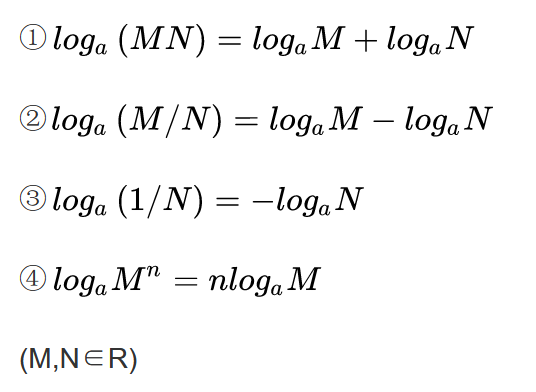

# 数学

## 符号

- ∈
> 属于，数学符号为“∈”，表示元素和集合之间的关系。
> 若a∈A，则a属于集合A，a是集合A中的元素。若a∉A，则a不属于集合A，a不是集合A中的元素。

## 知识复习
### 指数
> 指数是幂运算aⁿ(a≠0)中的一个参数，a为底数，n为指数，指数位于底数的右上角，幂运算表示指数个底数相乘。

```text
同底数幂相乘bai，底du数不变，指数相加；zhi(a^m)*（a^n）=a^(m+n)

同底数幂dao相除，zhuan底数不变，指数相减；(a^m)÷（a^n）=a^(m-n)

幂的乘方，底数不变，指数相乘；(a^m)^n=a^(mn)

积的乘方，等于每一个因式分别乘方；(ab)^n=(a^n)(b^n) 
```

### 对数
> 在数学中，对数是对求幂的逆运算，正如除法是乘法的倒数，反之亦然。

### 级数
> 级数是指将数列的项依次用加号连接起来的函数。
### 模运算
> “模”是“Mod”的音译，模运算多应用于程序编写中。

## 算法分析用到的四个数学定义
### 定义
- **大O标记法** 如果存在正常数c和n0使得当N>=n0时T(N)<=cf(N)，则记为T(N)=O(f(N))。
> 最后总会存在某个点n0，从它以后cf(N)总是至少与T(N)一样大，从而忽略常数因子7，则f(N)至少与T(N)一样大。
- 如果存在正常数c和n0使得当N>=n0时T(N)>=cg(N)，则记为T(N)=Ω(g(N))。
- 当且仅当T(N)=O(h(N))且T(N)=Ω(h(N))时，T(N)=Θ(h(N))。
- 如果T(N)=O(p(N))且T(N)≠Θ(p(N))，则T(N)=o(p(N))。

### 解释
```text
如果用传统的不等式来计算增长率，那么第一个定义是说T(N)的增长率小于等于f(N)的增长率。
第二个定义T(N)=Ω(g(N))是说T(N)的增长率大于等于g(N)的增长率。
第三个定义T(N)=Θ(h(N))是说T(N)的增长率等于h(N)的增长率。
最后一个定义T(N)=o(p(N))说的则是T(N)的增长率效率p(N)的增长率。
```

### 重要结论
- **法则1**：如果T1(N)=O(f(N))且T2(N)=O(g(N))，那么
 1. T1(N)+T2(N)=max(O(f(N)), O(g(N)))。
 1. T1(N)*T2(N)=O(f(N)) * O(g(N))。
- **法则2**：如果T(N)是一个k次多项式，则T(N)=Θ(N^2)。
- **法则3**：对任意常数k，log^kN=O(N)。它告诉我们对数增长得非常缓慢。

## 定理收集
 - 如果M>N，则M mod N<M/2。

## 等价关系
```text
若对于每一对元素(a ,),a, b∈S，aRb或者为true或者为false，则称在集合S上定义关系R。如果aRb是true，那么我们说
a与b有关系。

等价关系(equivalence relation)是满足下列三个性质的关系R:
1.(自反性)对于所有的a属于S,aRa。
2.(对称性)aRb当且仅当bRa。
3.(传递性)若aRb且bRc则aRc。
```


